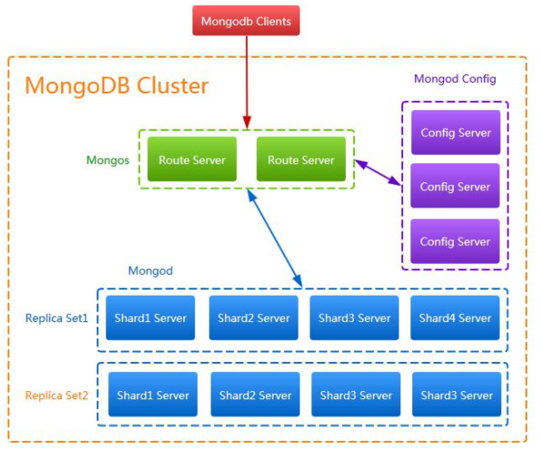

# MongoDB 中的基本概念及原理

​	MongoDB是一个基于分布式文件存储的数据库。由C++语言编写。旨在为WEB应用提供可扩展的高性能数据存储解决方案。Mongo是一个介于关系数据库和非关系数据库之间的产品，是非关系数据库当中功能最丰富，最像关系数据库的。

## 什么是 NoSQL  

​	NoSQL， 指的是非关系型的数据库。 NoSQL 有时也称作 Not Only SQL 的缩写， 是对不同于传
统的关系型数据库的数据库管理系统的统称。 NoSQL 用于超大规模数据的存储。 （例如谷歌
或 Facebook 每天为他们的用户收集万亿比特的数据） 。 这些类型的数据存储不需要固定的
模式， 无需多余操作就可以横向扩展。  

## 关系型数据库 PK 非关系型数据库

| 关系型数据库                 | NoSQL 数据库                                 |
| ---------------------------- | -------------------------------------------- |
| 高度组织化结构化数据         | 代表着不仅仅是 SQL                           |
| 结构化查询语言（SQL）        | 没有声明性查询语言                           |
| 数据和关系都存储在单独的表中 | 没有预定义的模式                             |
| 数据操作语言， 数据定义语言  | 键-值对存储， 列存储， 文档存储， 图形数据库 |
| 严格的一致性                 | 最终一致性， 而非 ACID 属性                  |
| 基础事务                     | 非结构化和不可预知的数据                     |
| CAP 定理                     |                                              |
| 高性能， 高可用性和可伸缩性  |                                              |

## NoSQL 数据库分类

| 类型           | 典型代表                   | 特点                                                         |
| -------------- | -------------------------- | ------------------------------------------------------------ |
| 列存储         | Hbase Cassandra Hypertable | 顾名思义， 是按照列存储数据的。 最大 的特点是方便存储结构化和半结构化 的数据， 方便做数据压缩， 对针对某一 列或者某几列的查询有非常大的 IO 优 势 |
| 文档存储       | MongoDB CounchDB           | 文档存储一般用类似 json 的格式存储， 存储的内容是文档型的。 这样也就有机 会对某些字段建立索引， 实现关系数据 库的某些功能。 |
| Key-value 存储 | Tokyo Cabinet/Tyrant       | 可以通过 key 快速查询到其 value。 一                         |

| Berkelery DB Memcache Redis | 般来说， 存储不管 value 的格式， 照单 全收。 (Redis 包含了其他功能) |                                                              |
| --------------------------- | ------------------------------------------------------------ | ------------------------------------------------------------ |
| 图存储                      | Neo4J FlockDB                                                | 图形关系的最佳存储。 使用传统关系数 据库来解决的话性能低下， 而且设计使 用不方便。 |
| 对象存储                    | Db4o Versant                                                 | 通过类似面向对象语言的语法操作数 据库， 通过对象的方式存储数据。 |
| XML 数据库                  | Berkeley DB XML BaseX                                        | 高效的存储 XML 数据， 并存储 XML 的内 部查询语法， 比如 XQ   |

## CAP原则

在计算机科学中，CAP定理（CAP theorem)，又被称作 布鲁尔定理（Brewer's theorem），它指出对于一个分布式计算系统来说，不可能同时满足一下三点：

- 一致性（Consistency）：所有节点在同一时间具有相同的数据
- 可用性（Availability）：保证每个请求不管成功或者失败都有响应
- 分区容错性（Partition tolerance）：系统中任意信息的丢失或失败不影响系统的继续运行

CAP理论的核心是：一个分布式系统不可能同时很好的满足一致性，可用性和分区容错性这三个需求，最多只能同时较好的满足两个。因此，根据CAP原理将NoSQL数据库分成了满足CA原则、满足CP原则和满足AP原则三大类：

- CA -单点集群，满足一致性，可用性的系统，通常在可扩展性上不太强大
- CP-满足一致性，分区容错性的系统，通常性能不是特别高。
- AP-满足可用性，分区容错性的系统，通常可能对一致性要求低一些。

## MongoDB 的数据结构与关系型数据库数据结构对比

| 关系型数据库术语/概念 | MongoDB 术语/概念     | 解释/说明                         |
| --------------------- | --------------------- | --------------------------------- |
| Database              | Database              | 数据库                            |
| Table                 | Collection            | 数据库表/集合                     |
| Row                   | Document              | 数据记录行/文档                   |
| Column                | Field                 | 数据列/数据字段                   |
| Index                 | Index                 | 索引                              |
| Table joins           | 表关联/MongoDB 不支持 |                                   |
| Primary Key           | Object ID             | 主键/MongoDB 自动将_id 设置为主键 |

## MongoDB 中的数据类型

| 数据类型 | 说明 | 解释                     | 举例         |
| -------- | ---- | ------------------------ | ------------ |
| Null     | 空值 | 表示空值或者未定义的对象 | {“ x” :null} |

| Boolean      | 布尔值     | 真或者假： true 或者 false                                   | {“ x” :true}               |
| ------------ | ---------- | ------------------------------------------------------------ | -------------------------- |
| Integer      | 整数       | 整型数值。 用于存储数值。 根据你所采用的服务器， 可 分为 32 位或 64 位。 |                            |
| Double       | 浮点数     | 双精度浮点值。                                               | {“ x” ： 3.14， ” y” ： 3} |
| String       | 字符串     | UTF-8 字符串                                                 |                            |
| Symbol       | 符号       | 符号。 该数据类型基本上等 同于字符串类型， 但不同的 是， 它一般用于采用特殊符 号类型的语言。 |                            |
| ObjectID     | 对象 ID    | 对象 ID。 用于创建文档的 ID。                                | {“ id” : ObjectId()}       |
| Date         | 日期       | 日期时间。 用 UNIX 时间格 式来存储当前日期或时间。           | {“ date” :new Date()}      |
| Timestamp    | 时间戳     | 从标准纪元开始的毫秒数                                       |                            |
| Regular      | 正则表达式 | 文 档中 可以 包 含正 则 表达 式， 遵循 JavaScript 的语法     | {“ foo” :/testdb/i}        |
| Code         | 代码       | 可以包含 JavaScript 代码                                     | {“ x” ： function() {}}    |
| Undefined    | 未定义     | 已废弃                                                       |                            |
| Array        | 数组       | 值的集合或者列表                                             | {“ arr” : [“ a” ,” b” ]}   |
| Binary Data  | 二进制     | 用于存储二进制数据。                                         |                            |
| Object       | 内嵌文档   | 文 档可 以作 为 文档 中 某个 key 的 value                    | {“x” :{“ foo” :” bar” }}   |
| Min/Max keys | 最小/大值  | 将一个值与 BSON（ 二进制的 JSON） 元素的最低值和最高 值相对比。 |                            |

## 图解 MongoDB 底层原理

MongoDB 的集群部署方案中有三类角色： 实际数据存储结点、 配置文件存储结点和路由接
入结点。
连接的客户端直接与路由结点相连， 从配置结点上查询数据， 根据查询结果到实际的存储结
点上查询和存储数据。 MongoDB 的部署方案有单机部署、 复本集（ 主备） 部署、 分片部署、
复本集与分片混合部署。
混合的部署方式如图：  

混合部署方式下向 MongoDB 写数据的流程如图：  

混合部署方式下读 MongoDB 里的数据流程如图：  

对于复本集， 又有主和从两种角色， 写数据和读数据也是不同， 写数据的过程是只写到主结
点中， 由主结点以异步的方式同步到从结点中：  

而读数据则只要从任一结点中读取， 具体到哪个结点读取是可以指定的：  

chunk， 分别存储到 3 个片服务器中， 如图所示：  

假如数据量很大， 需要增加片服务器时可以只要移动 chunk 来均分数据即可。
配置结点：
存储配置文件的服务器其实存储的是片键与 chunk 以及 chunk 与 server 的映射关系， 用上面
的数据表示的配置结点存储的数据模型如下表：  

Map1

| Key range | chunk  |
| --------- | ------ |
| [0,10)    | chunk1 |
| [10,20)   | chunk2 |
| [20,30)   | chunk3 |
| [30,40)   | chunk4 |
| [40,50)   | chunk5 |

Map2

| chunk  | shard  |
| ------ | ------ |
| chunk1 | shard1 |
| chunk2 | shard1 |
| chunk3 | shard2 |
| chunk4 | shard2 |
| chunk5 | shard3 |

路由结点：
路由角色的结点在分片的情况下起到负载均衡的作用

## MongoDB 的应用场景和不适用场景

1、 适用场景
对于 MongoDB 实际应用来讲， 是否使用 MongoDB 需要根据项目的特定特点进行一一甄别，
这就要求我们对 MongoDB 适用和不适用的场景有一定的了解。
根据 MongoDB 官网的说明， MongoDB 的适用场景如下:
1） 网站实时数据:MongoDB 非常适合实时的插入， 更新与查询， 并具备网站实时数据存储
所需的复制及高度伸缩性。
2） 数据缓存:由于性能很高， MongoDB 也适合作为信息基础设施的缓存层。 在系统重启之
后， 由 MongoDB 搭建的持久化缓存层可以避免下层的数据源过载。
3） 大尺寸、 低价值数据存储:使用传统的关系型数据库存储一些数据时可能会比较昂贵， 在
此之前， 很多时候程序员往往会选择传统的文件进行存储。
4） 高伸缩性场景:MongoDB 非常适合由数十或数百台服务器组成的数据库。 MongoDB 的路
线图中已经包含对 MapReduce 引擎的内置支持。
5） 对象或 JSON 数据存储:MongoDB 的 BSON 数据格式非常适合文档化格式的存储及查询。  

2、 不适用场景  

了解了 MongoDB 适用场景之后， 还需要了解哪些场景下不适合使用 MongoDB， 具体如下:
1） 高度事务性系统:例如银行或会计系统。 传统的关系型数据库目前还是更适用于需要
大量原子性复杂事务的应用程序。
2） 传统的商业智能应用:针对特定问题的 BI 数据库会对产生高度优化的查询方式。 对
于此类应用， 数据仓库可能是更合适的选择。
3） 需要复杂 SQL 查询的问题。
相信通过上面的说明， 你已经大致了解了 MongoDB 的使用规则， 需要说明一点的是，
MongoDB 不仅仅是数据库， 更多的使用是将 MongoDB 作为一个数据库中间件在实际应用中
合理划分使用细节， 这一点对于 MongoDB 应用来讲至关重要！  

## MongoDB 安装配置、 常用命令及客户端  

### 安装 MongoDB 数据库（Windows 和 Linux 环境）  

下载： https://www.mongodb.com/download-center?jmp=nav#community  

安装与启动
\1. 在 D 盘创建安装目录， D:\MongoDB， 将解压后的文件拷入新建的文件。
\2. 在 D 盘创建一个目录， D:\MongoDB\Data， 用于存放 MongoDB 的数据。
\3. 执行安装， 使用命令行， 进入 MongDb 的安装目录， 执行安装命令， 并指明存放 MongoDB
的路径  

> 注意， 如果这是你的目录中有空格， 会报 Invalid command 错误， 将 dbpath 后面的值加上双
> 引号即可 mongod.exe -dbpath=”D:\MongoDB\Data”。  

最后一行显示我们的 MongoDB 已经连接到 27017,它是默认的数据库的端口； 它建立完数据
库之后， 会在我们的 MongoDbData 文件夹下， 生成一些文件夹和文件： 在 journal 文件夹中
会存储相应的数据文件， NoSQL 的 MongoDB， 它以文件的形式， 也就是说被二进制码转换
过的 json 形式来存储所有的数据模型。  

4. 环境变量配置  

5. 启动数据库  

启动 MongoDB 数据库， 需要根据自己配置 mongodb.bat 文件， 在 D:\MongoDB\Server\3.4\bin
中创建一个 mongodb.bat 文件， 然后我们来编写这个可执行文件如下：
mongod --dbpath=D:\MongoDB\Data
运行 mongodb.bat 文件， MongoDB 便启动成功！  

## MongoDB 常用命令  

1、 创建数据库  

​	use testdb  

2、 创建集合  

​	db.t_member.insert({name:"zhaomin",age:23})  

3、 查询  

​	db.t_member.find()
​	db.t_member.findOne()  

4、 修改  

db.t_member.update({name:"zhaomin"},{$set:{age:18}}) 

＃ 不会影响其他属性列 ， 主键冲突会报错
db.t_member.update({name:"zhaomin"},{$set:{age:18}},true)

＃ 第三个参数为 true 则执行 insertOrUpdate 操作， 查询出则更新， 没查出则插入， 或者
var p = db.t_member.findOne();
db.t_member.update(p,{name:"zhaomin1"}) ＃ 会删除其他的属性列  

5、 删除  

＃ 删除满足条件的第一条 只删除数据 不删除索引

db.t_member.remove({age:1}) 
＃ 删除集合
db.t_member.drop();
＃ 删除数据库
db.dropDatabase();  

6、 查看集合
show collections
7、 查看数据库
show dbs
8、 插入数据
db.t_member.insert() ＃ 不允许键值重复
db.t_member.save() ＃ 若键值重复， 可改为插入操作
9、 批量更新
db.t_member.update({name:"zhaomin"},{$set:{name:"zhanmin11"}},false,true);
批量操作需要和选择器同时使用， 第一个 false 表示不执行 insertOrUpdate 操作， 第二
个 true 表示执行批量  

10、 更新器使用$set : 指定一个键值对， 若存在就进行修改， 不存在则添加
$inc ： 只使用于数字类型， 可以为指定键值对的数字类型进行加减操作：
db.t_member.update({name:"zhangsan"},{$inc:{age:2}})
执行结果是名字叫“zhangsan” 的年龄加了 2
$unset : 删除指定的键
db.t_member.update({name:"zhangsan"},{$unset:{age:1}})
$push : 数组键操作： 1、 如果存在指定的数组， 则为其添加值； 2、 如果不存在指定的
数组， 则创建数组键， 并添加值； 3、 如果指定的键不为数组类型， 则报错；
$pushAll : 批量想数组键插入值
db.t_member.update({name:"zhangsan"},{$pushAll:{classes:["English","Math","Chinese"]}});
$addToSet : 当指定的数组中有这个值时， 不插入， 反之插入
db.t_member.update({name:"zhangsan"},{$addToSet:{classes:"English"}}); ＃ 则不会添加到数组里
$pop： 删除指定数组的值， 当 value=1 删除最后一个值， 当 value=-1 删除第一个值
db.t_member.update({name:"zhangsan"},{$pop:{classes:1}}) ＃ 删除了最后一个值
$pull : 删除指定数组指定的值
db.persons.update({name:"zhangsan"},{$pull:{classes:"Chinese"}}) ＃ $pullAll 批量删除指定数组
db.t_member.update({name:"zhangsan"},{$pull:{classes:["Chinese"]}})
＃ 若数组中有多个 Chinese， 则全删除
$ : 修改指定数组时， 若数组有多个对象， 但只想修改其中一些， 则需要定位器：
db.t_member.update({"classes.type":"AA"},{$set:{"classes.$.sex":"male"}})
$addToSet 与 $each 结合完成批量数组更新操作
db.t_member.update({name:"zhangsan"},{$set:{classes:{$each:["chinese","art"
]}}})  

10、 更新器使用$set : 指定一个键值对， 若存在就进行修改， 不存在则添加
$inc ： 只使用于数字类型， 可以为指定键值对的数字类型进行加减操作：
db.t_member.update({name:"zhangsan"},{$inc:{age:2}})
执行结果是名字叫“zhangsan” 的年龄加了 2
$unset : 删除指定的键
db.t_member.update({name:"zhangsan"},{$unset:{age:1}})
$push : 数组键操作： 1、 如果存在指定的数组， 则为其添加值； 2、 如果不存在指定的
数组， 则创建数组键， 并添加值； 3、 如果指定的键不为数组类型， 则报错；
$pushAll : 批量想数组键插入值
db.t_member.update({name:"zhangsan"},{$pushAll:{classes:["English","Math","Chinese"]}});
$addToSet : 当指定的数组中有这个值时， 不插入， 反之插入
db.t_member.update({name:"zhangsan"},{$addToSet:{classes:"English"}}); ＃ 则不会添加到数组里
$pop： 删除指定数组的值， 当 value=1 删除最后一个值， 当 value=-1 删除第一个值
db.t_member.update({name:"zhangsan"},{$pop:{classes:1}}) ＃ 删除了最后一个值
$pull : 删除指定数组指定的值
db.persons.update({name:"zhangsan"},{$pull:{classes:"Chinese"}}) ＃ $pullAll 批量删除指定数组  

db.t_member.update({name:"zhangsan"},{$pull:{classes:["Chinese"]}})
＃ 若数组中有多个 Chinese， 则全删除
$ : 修改指定数组时， 若数组有多个对象， 但只想修改其中一些， 则需要定位器：
db.t_member.update({"classes.type":"AA"},{$set:{"classes.$.sex":"male"}})
$addToSet 与 $each 结合完成批量数组更新操作
db.t_member.update({name:"zhangsan"},{$set:{classes:{$each:["chinese","art"
]}}})  

11、 runCommand 函数和 findAndModify 函数  

runCommand({
findAndModify:"persons",
query:{查询器},
sort:{排序},
update:{修改器},
new:true 是否返回修改后的数据
});
runCommand 函数可执行 mongdb 中的特殊函数
findAndModify 就是特殊函数之一， 用于返回执行返回 update 或 remove 后的文档
例如：
ps=db.runCommand({
findAndModify:"persons",
query:{name:"zhangsan"},
update:{$set:{name:"lisi"}},
new:true
})
ps.value  

12、 高级查询详解  

db.t_member.find({},{_id:0,name:1})
第一个空括号表示查询全部数据， 第二个括号中值为 0 表示不返回， 值为 1 表示返回， 默认
情况下若不指定主键， 主键总是会被返回；
db.persons.find({条件},{指定键});
比较操作符： $lt: < $lte: <= $gt: > $gte: >= $ne: !=
12.1、 查询条件
db.t_member.find({age:{$gte:25,$lte:27}},{_id:0,name:1,age:1})
＃ 查询年龄大于等于 25 小于等于 27 的人
db.t_member.find({country:{$ne:"韩国"}},{_id:0,name:1,country:1})
＃ 查询出所有国籍不是韩国的人的数学成绩
12.2、 包含与不包含（仅针对于数组）
$in 或 $nin
db.t_member.find({country:{$in:["China","USA"]}},{_id:0,name:1:country:1})
＃ 查询国籍是中国或美国的学生信息
12.3、 $or 查询
db.t_member.find({$or:[{c:{$gt:85}},{e:{$gt:90}}]},{_id:0,name:1,c:1,e:1})
＃ 查询语文成绩大于 85 或者英语大于 90 的学生信息
db.t_member.update({country:"China"},{$set:{sex:"m"}},false,true)
＃ 把中国国籍的学生上增加新的键 sex
db.t_member.find({sex:{$in:[null]}},{_id:0,name:1,sex:1})
＃ 查询出 sex 为 null 的人
12.4、 正则表达式
db.t_member.find({name:/li/i},{_id:0,name:1})
＃ 查询出名字中存在”li”的学生的信息
12.5、 $not 的使用
$not 和$nin 的区别是$not 可以用在任何地方儿$nin 是用到集合上的
db.t_member.find({name:{$not:/li/i}},{_id:0,name:1})
＃ 查询出名字中不存在”li”的学生的信息
12.6、 $all 与 index 的使用
db.t_member.find({books:{$all:["JS","MONGODB"]}},{_id:0,name:1})
＃ 查询喜欢看 MONGOD 和 JS 的学生
db.t_member.find({"books.1":"JAVA"},{_id:0,name:1,books:1})
＃ 查询第二本书是 JAVA 的学习信息
12.7、 $size 的使用， 不能与比较查询符同时使用
db.t_member.find({books:{$size:4}},{_id:0,name:1})
＃ 查询出喜欢的书籍数量是 4 本的学生
12.8、 查询出喜欢的书籍数量大于 4 本的学生本的学生
1） 增加 size 键
db.t_member.update({},{$set:{size:4}},false,true)
2） 添加书籍,同时更新 size
db.t_member.update({name:"jim"},{$push:{books:"ORACL"},$inc:{size:1}})
3） 查询大于 3 本的
db.t_member.find({size:{$gt:4}},{_id:0,name:1,size:1})
12.9、 $slice 操作符返回文档中指定数组的内部值
db.t_member.find({name:"jim"},{_id:0,name:1,books:{$slice:[1,3]}})
＃ 查询出 Jim 书架中第 2~4 本书
db.t_member.find({name:"jim"},{_id:0,name:1,books:{$slice:-1}})
＃ 查询出最后一本书
12.10、 文档查询
查询出在 K 上过学且成绩为 A 的学生
1） 绝对查询， 顺序和键个数要完全符合
db.t_member.find({school:{school:"K","score":"A"}},{_id:0,name:1})
2） 对象方式,但是会出错， 多个条件可能会去多个对象查询
db.t_member.find({"school.school":"K","school.score":"A"},{_id:0,name:1})
3） 正确做法单条条件组查询$elemMatch
db.t_member.find({school:{$elemMatch:{school:"K",score:"A"}},{_id:0,name:1}
) d
b.t_member.find({age:{$gt:22},books:"C++",school:"K"},{_id:0,name:1,age:1,
books:1,school:1})
12.11、 分页与排序
1） limit 返回指定条数 查询出 persons 文档中前 5 条数据：
db.t_member.find({},{_id:0,name:1}).limit(5)
2） 指定数据跨度 查询出 persons 文档中第 3 条数据后的 5 条数据
db.t_member.find({},{_id:0,name:1}).limit(5).skip(3)
3） sort 排序 1 为正序， -1 为倒序
db.t_member.find({},{_id:0,name:1,age:1}).limit(5).skip(3).sort({age:1})
注意:mongodb 的 key 可以存不同类型的数据排序就也有优先级
最小值->null->数字->字符串->对象/文档->数组->二进制->对象 ID->布尔->日期->时间戳->正
则->最大值
12.12、 游标
利用游标遍历查询数据
var persons = db.persons.find();
while(persons.hasNext()){
obj = persons.next();
print(obj.name)
} 游
标几个销毁条件
1).客户端发来信息叫他销毁
2).游标迭代完毕
3).默认游标超过 10 分钟没用也会别清除
12.13、 查询快照
快照后就会针对不变的集合进行游标运动了,看看使用方法.
db.persons.find({$query:{name:”Jim”},$snapshot:true})
＃ 用快照则需要用高级查询
高级查询选项
1)$query
2)$orderby
3)$maxsan： integer 最多扫描的文档数
4)$min： doc 查询开始
5)$max： doc 查询结束
6)$hint： doc 使用哪个索引
7)$explain:boolean 统计
8)$snapshot:boolean 一致快照
14.1、 查询点(70,180)最近的 3 个点
db.map.find({gis:{$near:[70,180]}},{_id:0,gis:1}).limit(3)
14.2、 查询以点(50,50)和点(190,190)为对角线的正方形中的所有的点
db.map.find({gis:{$within:{$box:[[50,50],[190,190]]}}},{_id:0,gis:1})
14.3、 查询出以圆心为(56,80)半径为 50 规则下的圆心面积中的点
db.map.find({gis:{$with:{$center:[[56,80],50]}}},{_id:0,gis:1})
15、 Count+Distinct+Group
15.1、 count 查询结果条数
db.persons.find({country:"USA"}).count()
15.2、 Distinct 去重
请查询出 persons 中一共有多少个国家分别是什么
db.runCommand({distinct:"persons",key:"country"}).values
＃ key 表示去重的键
15.3、 group 分组
db.runCommand({ group:{
ns:"集合的名字",
key:"分组键对象",
initial:"初始化累加器",
$reduce:"分解器",
condition:"条件",
finalize:"组完成器"
}})
分组首先会按照 key 进行分组,每组的 每一个文档全要执行$reduce 的方法,他接收 2 个参数
一个是组内本条记录,一个是累加器数据.
请查出 persons 中每个国家学生数学成绩最好的学生信息(必须在 90 以上)
db.runCommand({
group:{
ns:"persons",
key:{"country":true},
initial:{m:0},
$reduce:function(doc,prev){
if(doc.m>prev.m){
prev.m = doc.m;
prev.name = doc.m;
prev.country = doc.country;
}
},
condition:{m:{$gt:90}},
finalize:function(prev){
prev.m = prev.name+" comes from "+prev.country+" ,Math score is "+prev.m;
}
}
})
15.4.函数格式化分组键
如果集合中出现键 Counrty 和 counTry 同时存在
$keyf:function(doc){
if(doc.country){
return {country:doc.country}
} r
eturn {country:doc.counTry}
} 1
6、 常用命令举例
16.1、 查询服务器版本号和主机操作系统
db.runCommand({buildInfo:1})
16.2、 查询执行集合的详细信息,大小,空间,索引等
db.runCommand({collStats:"persons"})
16.3、 查看操作本集合最后一次错误信息
db.runCommand({getLastError:"persons"})
17、 固定集合
17.1、 特性
固定集合默认是没有索引的就算是_id 也是没有索引的
由于不需分配新的空间他的插入速度是非常快的
固定集合的顺是确定的导致查询速度是非常快的
最适合就是日志管理
17.2、 创建固定集合
创建一个新的固定集合要求大小是 100 个字节,可以存储文档 10 个
db.createCollection("mycoll",{size:100,capped:true,max:10})
把一个普通集合转换成固定集合
db.runCommand({convertToCapped:"persons",size:1000})
17.3、 对固定集合反向排序， 默认情况是插入的顺序排序
db.mycoll.find().sort({$natural:-1})  

## 安装 Studio3T 客户端  